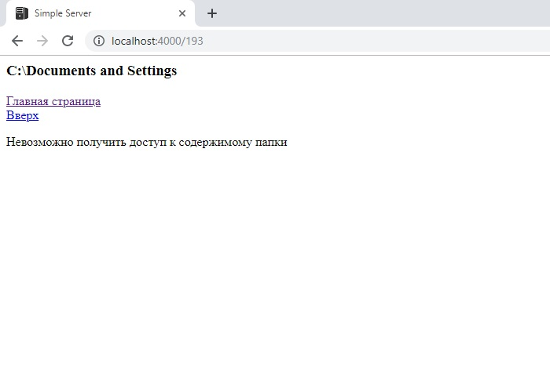

# SimpleServer

Этот проект - первая попытка написать несложный http-web-сервер. За основу проекта я взял уроки типа "создаем простейший http-сервер", в которых дается представление о том, как создать серверный сокет, как подключить к нему клиента и как передать клиенту некоторые данные типа строки "Hello World!". Подобных уроков можно найти огромное множество. Но в своей работе я решил пойти несколько дальше отдачи клиенту простой текстовой строки.
Вместо кода отдающего обычный текст я написал свой, который реализует функцию простейшего файлового менеджера. Клиент, подключившийся к серверу получает возможность просматривать файловую систему сервера прямо у себя в браузере. Также добавил возможность передачи клиенту изображения: значка favicon, используемого браузерами при добавлении сайта в избранное.
Состав классов проекта такой:
- MainClass. С него начинается выполнение программы. Создает основные объекты программы.
- GUI - простейший графический интерфейс. Нужен для вывода сообщений о работе сервера и запрашиваемых страницах.
- PortListener. Класс, реализующий поток-демон. Прослушивает порт сервера (4000) и подключает клиентов.
- ServerProcess. Данный класс реализует поток, который запускается при подключении клиента. Необходим для реализации сетевых операций: при   подключении клиента получает у него http-запрос, парсит его, вделяет из него запрашиваемый url и отдает объекту класса ContentGenerator.   Полученный от ContentGenerator'а ответ запаковывает в http-пакет, отправляет кленту и разрывает соединение.
- ContentGenerator. Получает запрашиваемые клиентом url и на их основе генерирует отдаваемые клиенту web-странички (или файл favicon.ico,   если он запрошен).
Скрины проекта ниже:

